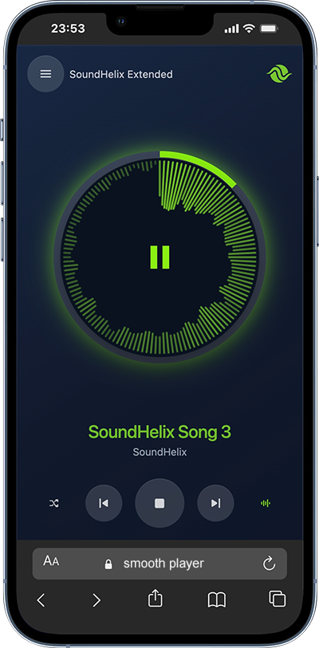

# Smooth Player

Smooth Player is a TypeScript audio player for the web with built-in playlist handling, visualizers, accent-based styling, and reusable UI mount helpers.

## Features

- Single track and playlist playback
- Nested playlists (`AudioPlaylist` inside `PlaylistEntry`)
- Drag and drop audio files and playlist files (`.m3u`, `.m3u8`)
- Built-in visualizer support and configurable visual styles
- Automatic UI behavior for single-track vs multi-track playlists
- Accent + background theming via config/API (with generated gradients)
- Standard UI helpers with optional user preference persistence
- Debug hooks and runtime telemetry bindings
- Typed API (`.d.ts`) with ESM + CJS builds

## Install

```bash
npm install smooth-player
```



## Quick Start

```ts
import { SmoothPlayer, mountPlayerUI } from "smooth-player";
import "smooth-player/dist/smooth-player.css";

const tracks = [
  {
    id: "song-1",
    src: "/audio/song-1.mp3",
    metadata: { title: "Song 1", artist: "Artist 1" },
  },
  {
    id: "song-2",
    src: "/audio/song-2.mp3",
    metadata: { title: "Song 2", artist: "Artist 2" },
  },
];

const player = new SmoothPlayer({
  playlist: tracks,
  initialVolume: 0.8,
  visualizer: "spectrum",
  accentColor: "#0ed2a4",
  backgroundColor: "#0b1220",
  debug: false,
});

const root = document.querySelector("#player-root");
if (!(root instanceof HTMLElement)) throw new Error("Missing #player-root");

mountPlayerUI(player, root);
```

## Core Config (`SmoothPlayerOptions`)

- `audio?: HTMLAudioElement`
- `playlist?: PlaylistEntry[]`
- `visualizer?: "spectrum" | "waveform" | "none"` (default: `"spectrum"`)
- `accentColor?: string` (default: `#0ed2a4`)
- `backgroundColor?: string` (default: `#0b1220`)
- `debug?: boolean` (default: `false`)
- `crossOrigin?: HTMLMediaElement["crossOrigin"]` (default: `"anonymous"`)
- `initialVolume?: number`
- `initialTrackIndex?: number`
- `initialShuffle?: boolean`
- `autoplay?: boolean`
- `loop?: boolean`
- `durationFallback?: boolean` (default: `true`, fallback decode for unknown metadata duration)
- `analyzer?: { fftSize, smoothingTimeConstant, minDecibels, maxDecibels }`

## Visualizer

At runtime:

```ts
player.setVisualizer("waveform");
const current = player.getVisualizer(); // "waveform"
```

Raw data API:

- `getSpectrumData()`
- `getWaveformData()`

Exported visualizer classes:

- `CanvasRadialVisualizer`
- `CanvasSpectrumVisualizer`
- `CanvasWaveformVisualizer`

## Debug

Enable debug directly in config:

```ts
const player = new SmoothPlayer({
  playlist: tracks,
  debug: true,
});
```

Use `mountDebugPanel(...)` to bind debug metrics to your own elements, or call `mountPlayerUI(player, root, { debugEnabled: true })` to auto-generate the debug panel in the mounted UI.

Runtime methods:

- `setDebug(enabled: boolean)`
- `getDebug()`

## Playlists (including nested)

```ts
const playlist = [
  {
    id: "focus",
    title: "Focus",
    tracks: [
      { id: "f-1", src: "/audio/focus-1.mp3", metadata: { title: "Focus 1" } },
      {
        id: "focus-deep",
        title: "Focus Deep",
        tracks: [{ id: "fd-1", src: "/audio/focus-deep-1.mp3", metadata: { title: "Deep 1" } }],
      },
    ],
  },
  {
    id: "chill",
    title: "Chill",
    tracks: [{ id: "c-1", src: "/audio/chill-1.mp3", metadata: { title: "Chill 1" } }],
  },
];

const player = new SmoothPlayer({ playlist });
player.selectPlaylist("chill");
```

Playlist API highlights:

- `setPlaylist(entries, startIndex?)`
- `getPlaylists()`
- `getCurrentPlaylist()`
- `selectPlaylist(playlistId, startIndex?)`

## Events

Subscribe with `player.on(eventName, handler)`:

- `ready`
- `play`
- `pause`
- `ended`
- `playlistchange`
- `trackchange`
- `durationchange`
- `timeupdate`
- `volumechange`
- `error`

## Player API Overview

Playback:

- `play(index?)`
- `pause()`
- `toggle()`
- `next()`
- `previous()`
- `seek(seconds)`
- `setVolume(volume)`
- `setLoop(loop)`

Playlist and track management:

- `setPlaylist(entries, startIndex?)`
- `selectPlaylist(playlistId, startIndex?)`
- `loadTrack(track)`
- `getPlaylist()`
- `getPlaylists()`
- `getCurrentPlaylist()`
- `getCurrentTrack()`
- `getCurrentTrackIndex()`

Visualizer and style:

- `setVisualizer(mode)`
- `getVisualizer()`
- `setSpectrumStyle(options)`
- `getSpectrumStyle()`
- `setWaveformStyle(options)`
- `getWaveformStyle()`
- `configureAnalyzer(options)`
- `getSpectrumData()`
- `getWaveformData()`

State and utility:

- `getState()`
- `formatTime(seconds)`
- `getDuration()`
- `getCurrentTime()`
- `getAudioElement()`
- `setAccentColor(color)`
- `getAccentColor()`
- `applyAccentColor(targetElement)`
- `setDebug(enabled)`
- `getDebug()`
- `setBackgroundColor(color)`
- `getBackgroundColor()`
- `applyBackgroundColor(targetElement)`
- `applyTheme(targetElement)` (accent + background)

## UI Mount Helpers

- `mountPlayerUI(player, root, options?)`
- `mountAudioDrop(target, options?)`
- `mountTrackInfo(titleElement, artistElement, options?)`
- `mountPlayButton(buttonElement, options?)`
- `mountProgress(options)`
- `mountTransportControls(options)`
- `mountShuffleToggle(options)`
- `mountPlaylistPanel(options)`
- `mountPlaylistSwitcher(container, options?)`
- `mountPlaylist(container, options?)`
- `mountPlaylistTitle(element, options?)`
- `mountDebugPanel(options)`

### Player UI options

`mountPlayerUI(player, root, options?)` supports:

- `debugEnabled?: boolean`
- `enableAudioDrop?: boolean` (default: `true`)
- `enableErrorNotice?: boolean` (default: `true`)
- `showLogo?: boolean` (default: `true`)
- `persistUserPreferences?: boolean` (default: `true`)

When preference persistence is enabled, user choices can override initial UI configuration on next sessions.

### Drag and drop behavior

`mountAudioDrop(target, options?)` accepts:

- `activeClassName?: string` (default: `is-drag-over`)
- `onDrop?: ({ file, track, tracks, kind }) => void`
  - `kind` is `"audio"` or `"playlist"`
  - `tracks` contains all resolved tracks (single/multiple audio files or parsed M3U/M3U8)

Notes:

- Dropping audio files builds a playlist from dropped files and starts playback from the first track.
- Dropping an `.m3u`/`.m3u8` parses entries and starts playback from the first valid track.
- If the drop includes both playlist + local audio files, local files are used when playlist entries match file names.

### Error notices (including CORS)

The standard UI listens for player `error` events and shows a temporary notice banner.
For cross-origin sources that fail with `MEDIA_ERR_SRC_NOT_SUPPORTED`, the message indicates a likely CORS issue.

## Utility Methods

- `setAccentColor(color)`
- `getAccentColor()`
- `applyAccentColor(targetElement)`
- `setBackgroundColor(color)`
- `getBackgroundColor()`
- `applyBackgroundColor(targetElement)`
- `applyTheme(targetElement)`
- `formatTime(seconds)`
- `getState()`
- `getAudioElement()`

## Scripts

- `npm run i18n:sync`
- `npm run dev`
- `npm run build`
- `npm run build:css`
- `npm run typecheck`
- `npm run demo`

`i18n:sync` generates `src/i18n/en.generated.ts` from `src/i18n/en.json`.
This keeps runtime modules JavaScript-only while preserving JSON as the source of UI strings.

## Local Demo

```bash
npm install
npm run demo
```

Open:

- `http://127.0.0.1:4173/examples/demo.html`
- `http://127.0.0.1:4173/examples/demo.html?debug=1`

## Roadmap

- Split reusable UI pieces into dedicated component packages
- Keep `SmoothPlayer` core focused on engine + typed API
- Provide clearer package boundaries for framework-specific integrations

## Media Attribution and CORS

Audio tracks included in this repository are provided for demonstration purposes only.

- Part of the demo media is sourced from [Pixabay](https://pixabay.com/).
- Additional demo files are [SoundHelix songs](https://soundcloud.com/soundhelix) available in `examples/audio`.

If you load audio from external hosts, those sources must be CORS-enabled for browser playback and analysis features.
The media server should return a valid `Access-Control-Allow-Origin` header for your application origin (or `*` when appropriate).
Without proper CORS headers, browsers may block playback and prevent analyzer/visualizer processing.
